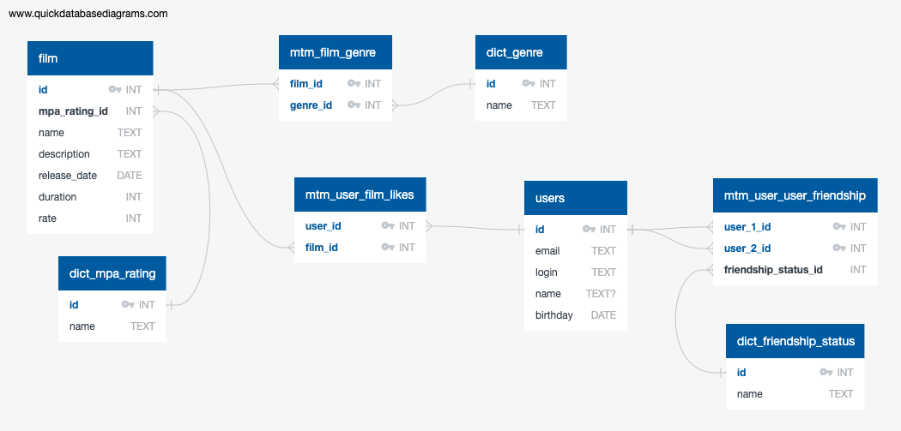

# java-filmorate

## ER-диаграмма



В схеме применяется соглашения о наименовании:

* таблицы, описывающие отношение "Многие-ко-Многим", имеют префикс `mtm`;
* таблицы-словари имеют префикс `dict`.

## Примеры SQL-запросов

Получить всех пользователей с именем Максим:

```sql
SELECT *
FROM user
WHERE name = 'Максим';
```

Получить все фильмы вышедшие в 2022 году

```sql
SELECT *
FROM film
WHERE EXTRACT(YEAR FROM release_date) = 2022;
```

Получить топ 10 самых лайкнутых фильмов:

```sql
SELECT film.name,
       COUNT(likes.user_id) AS cnt_likes
FROM mtm_user_film_likes AS likes
         JOIN film ON likes.film_id = film.id
GROUP BY likes.film_id
ORDER BY cnt_likes DESC
LIMIT 10;
```

Получить общих друзей у пользователя с ID = 1 и ID = 2:

```sql
SELECT user_2_id
FROM mtm_user_user_friendship
WHERE user_1_id = 1
INTERSECT
SELECT user_2_id
FROM mtm_user_user_friendship
WHERE user_1_id = 2
```